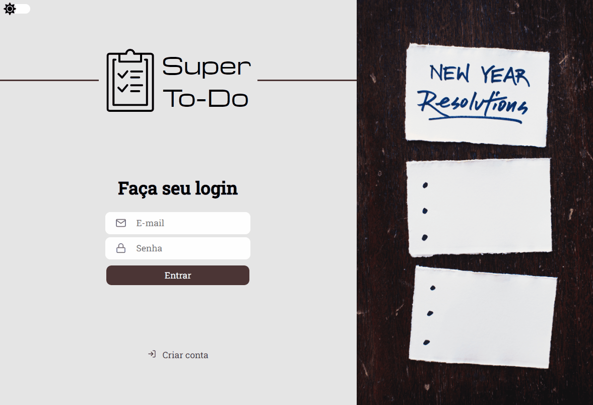
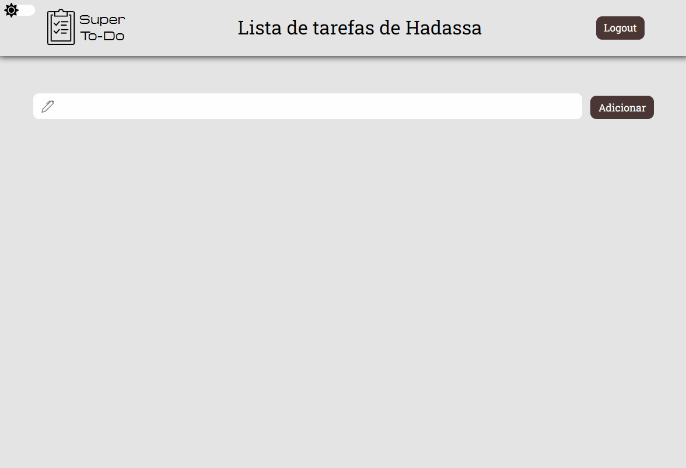

<h1 align="center">Super To-Do</h1>

  
  
  

## Tecnologias

Esse projeto foi desenvolvido com as seguintes tecnologias::

✔️Typescript

✔️React

✔️React Hooks

✔️Context API

✔️Styled-components

✔️React Router Dom

✔️Yup

✔️Unform

✔️Axios

✔️Polished

✔️Eslint

✔️Prettier

## 💻 Projeto

Super To-Do é um site web que permite aos usuários guardar uma lista de fazeres.

## ⚙ Configuração

1- Para instalar as dependências:

> npm install

2- Para iniciar a aplicação:

> npm start

---
